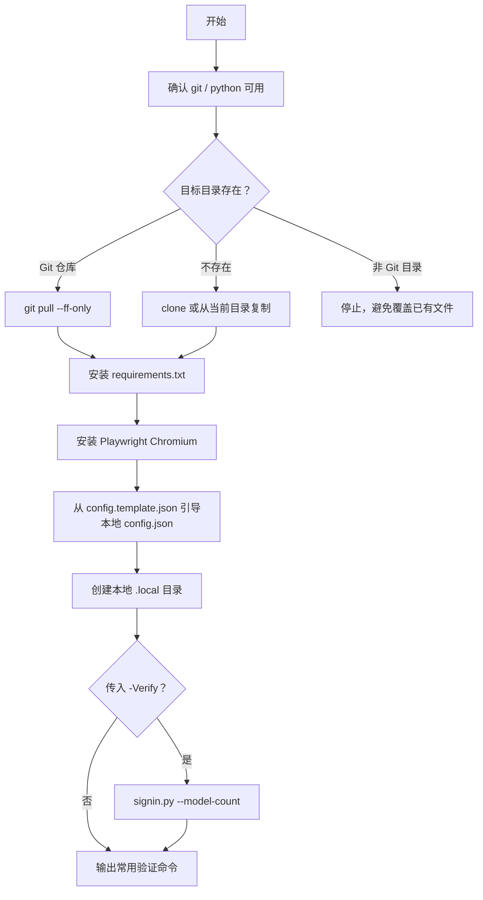

# 快速安装

这个仓库是私有仓库。新电脑需要先能访问 `vegetpig/super-imyaigc-signin`，推荐安装并登录 GitHub CLI。

## 方式一：GitHub CLI 克隆安装

```powershell
gh auth login
mkdir $env:USERPROFILE\.codex\skills -Force
cd $env:USERPROFILE\.codex\skills
gh repo clone vegetpig/super-imyaigc-signin
cd super-imyaigc-signin
powershell -ExecutionPolicy Bypass -File .\install.ps1
```

如果要在安装完成后立刻执行真实验证：

```powershell
powershell -ExecutionPolicy Bypass -File .\install.ps1 -Verify -Phone YOUR_PHONE
```

如果只是先把环境装好，不想立刻触发登录验证：

```powershell
powershell -ExecutionPolicy Bypass -File .\install.ps1
```

## 方式二：下载 Release 压缩包安装

1. 打开私有仓库的 Releases 页面。
2. 下载对应版本压缩包。
3. 解压后进入目录。
4. 执行：

```powershell
powershell -ExecutionPolicy Bypass -File .\install.ps1
```

安装脚本会把当前目录复制到：

```text
%USERPROFILE%\.codex\skills\super-imyaigc-signin
```

## 安装脚本做了什么



## 参数

| 参数 | 说明 |
| --- | --- |
| `-RepoUrl` | Git clone 地址，默认当前私有仓库 |
| `-TargetDir` | 安装目录，默认 `%USERPROFILE%\.codex\skills\super-imyaigc-signin` |
| `-Phone` | 验证时使用的手机号；不传时由 `signin.py` 按当前配置处理 |
| `-SkipDependencies` | 跳过 Python 依赖安装 |
| `-SkipPlaywright` | 跳过 Playwright Chromium 安装 |
| `-Verify` | 安装完成后运行 `signin.py --model-count` |

## 首次安装后的本地配置

首次安装时，脚本会自动创建本地 `scripts/config.json`。仓库里只跟踪模板 `scripts/config.template.json`。

最小示例：

```json
{
  "accounts": [
    {
      "phone": "YOUR_PHONE",
      "password": ""
    }
  ],
  "proxy": {
    "enabled": false,
    "auto_detect": false,
    "server": "",
    "username": "",
    "password": ""
  }
}
```

然后写入密码：

```powershell
python ".\scripts\signin.py" --set-password YOUR_PHONE "<PASSWORD>"
```

## 安装后验证

```powershell
cd $env:USERPROFILE\.codex\skills\super-imyaigc-signin
python ".\scripts\signin.py" --phone YOUR_PHONE --model-count
python ".\scripts\imyai_chat.py" --phone YOUR_PHONE --list-models-compact
python ".\scripts\imyai_image.py" --phone YOUR_PHONE --list-models-compact
```

真实聊天验收：

```powershell
python ".\scripts\imyai_chat.py" --phone YOUR_PHONE --model "Qwen 3.6 flash" --prompt "Reply exactly: ok" --no-official-history --json
```

## 常见结果说明

- `install.ps1 -Verify` 如果在空白模板配置下失败，并提示 `No accounts configured`，这是正确行为，说明安装没有偷偷复用旧机器 Cookie。
- 真实登录链路依赖本地 `scripts/config.json`、`scripts/.secret_key`、`.local/cookies/` 等运行时文件，这些都不会提交到 Git。

## 更新

```powershell
cd $env:USERPROFILE\.codex\skills\super-imyaigc-signin
git pull --ff-only
powershell -ExecutionPolicy Bypass -File .\install.ps1 -SkipPlaywright
```
