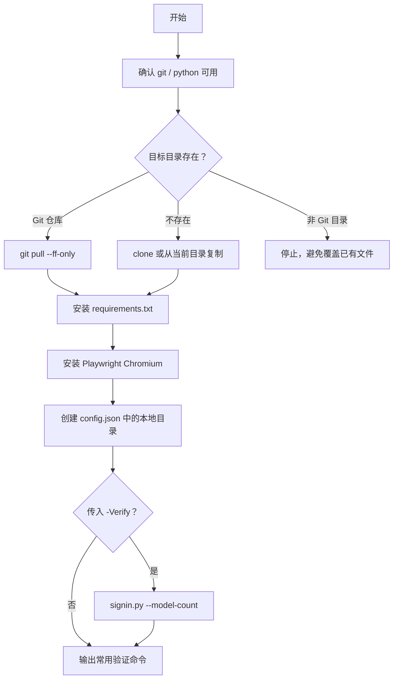

# 快速安装

这个仓库是私有仓库。新电脑需要先能访问 `vegetpig/super-imyaigc-signin`，推荐安装并登录 GitHub CLI。

## 方式一：GitHub CLI 克隆安装

```powershell
gh auth login
mkdir $env:USERPROFILE\.codex\skills -Force
cd $env:USERPROFILE\.codex\skills
gh repo clone vegetpig/super-imyaigc-signin
cd super-imyaigc-signin
powershell -ExecutionPolicy Bypass -File .\install.ps1 -Verify
```

如果不想立刻触发登录验证：

```powershell
powershell -ExecutionPolicy Bypass -File .\install.ps1
```

## 方式二：下载 Release 压缩包安装

1. 打开私有仓库的 Releases 页面。
2. 下载 `super-imyaigc-signin-v0.1.0.zip`。
3. 解压后进入目录。
4. 执行：

```powershell
powershell -ExecutionPolicy Bypass -File .\install.ps1
```

安装脚本会把当前目录复制到：

```text
%USERPROFILE%\.codex\skills\super-imyaigc-signin
```

## 安装脚本做了什么



## 参数

| 参数 | 说明 |
| --- | --- |
| `-RepoUrl` | Git clone 地址，默认当前私有仓库 |
| `-TargetDir` | 安装目录，默认 `%USERPROFILE%\.codex\skills\super-imyaigc-signin` |
| `-Phone` | 验证时使用的手机号，默认当前配置账号 |
| `-SkipDependencies` | 跳过 Python 依赖安装 |
| `-SkipPlaywright` | 跳过 Playwright Chromium 安装 |
| `-Verify` | 安装完成后运行 `signin.py --model-count` |

## 安装后验证

```powershell
cd $env:USERPROFILE\.codex\skills\super-imyaigc-signin
python ".\scripts\signin.py" --phone YOUR_PHONE --model-count
python ".\scripts\imyai_chat.py" --phone YOUR_PHONE --list-models-compact
python ".\scripts\imyai_image.py" --phone YOUR_PHONE --list-models-compact
```

## 更新

```powershell
cd $env:USERPROFILE\.codex\skills\super-imyaigc-signin
git pull --ff-only
powershell -ExecutionPolicy Bypass -File .\install.ps1 -SkipPlaywright
```
