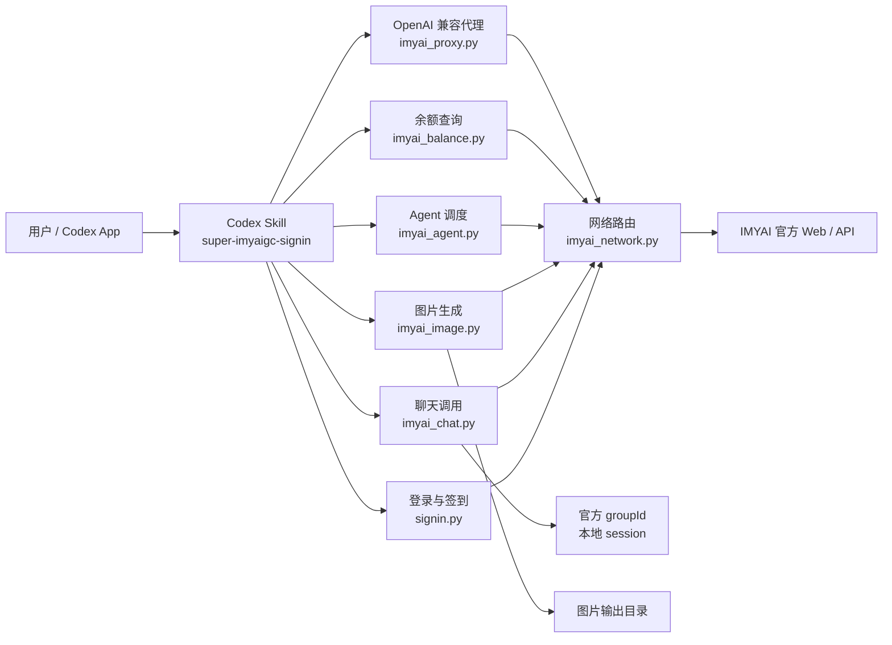
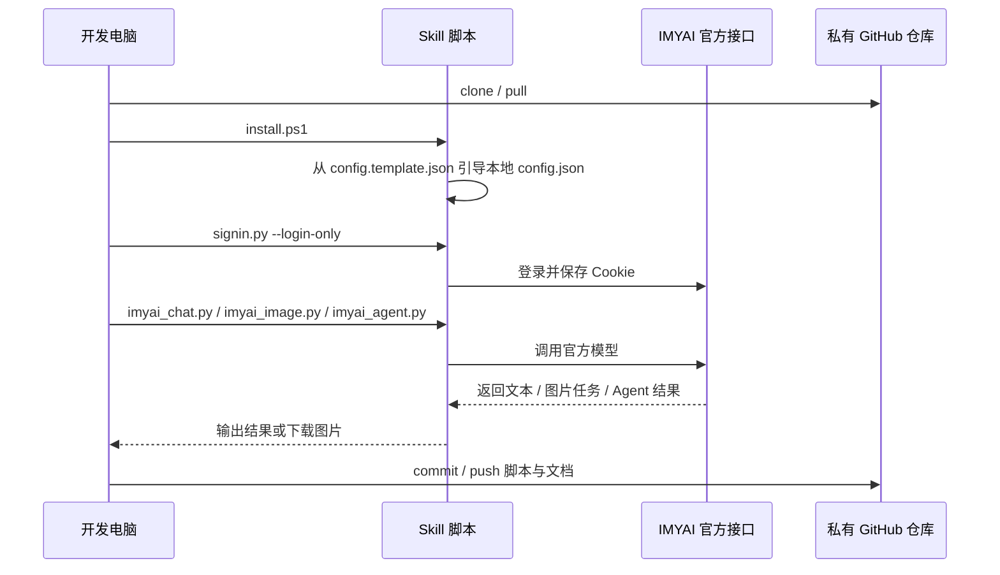
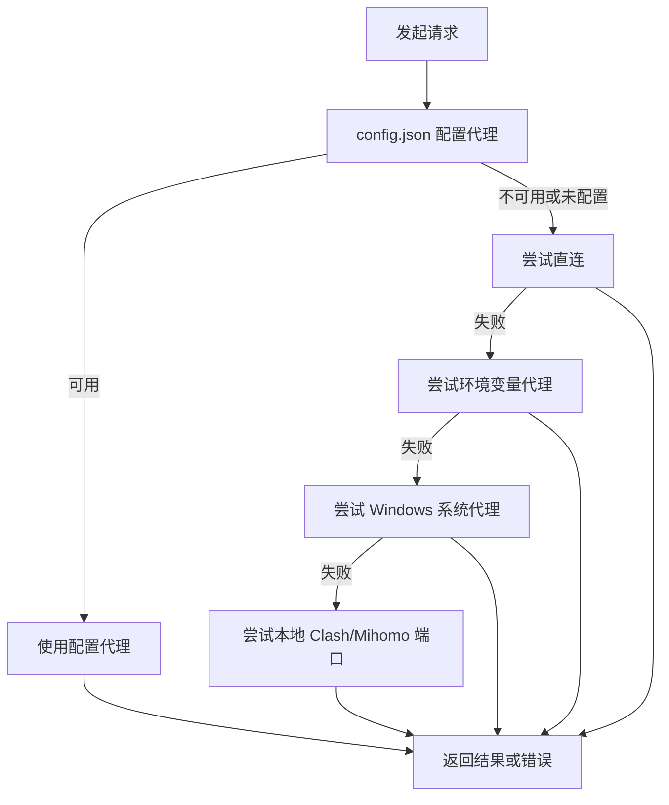

# super-imyaigc-signin

私有 Codex Skill 仓库，用于在 Codex App 中通过仓库内置脚本调用 IMYAI 官方聊天模型、绘图模型和 Agent，并维护登录、签到、会话、余额、OpenAI 兼容代理和多机协作流程。


## 快速安装

推荐新电脑直接使用 GitHub CLI 安装：

```powershell
gh auth login
mkdir $env:USERPROFILE\.codex\skills -Force
cd $env:USERPROFILE\.codex\skills
gh repo clone vegetpig/super-imyaigc-signin
cd super-imyaigc-signin
powershell -ExecutionPolicy Bypass -File .\install.ps1
```

如果安装后要立刻验证登录和模型列表：

```powershell
powershell -ExecutionPolicy Bypass -File .\install.ps1 -Verify -Phone YOUR_PHONE
```

也可以从 GitHub Releases 下载压缩包，解压后在仓库目录执行：

```powershell
powershell -ExecutionPolicy Bypass -File .\install.ps1
```

更多安装细节见 [INSTALL.md](INSTALL.md)。

## 浏览器策略

- 优先使用仓库内置脚本处理 IMYAI 登录、JWT 刷新、聊天、绘图、余额查询和代理转发。
- 不要默认打开 Codex in-app browser / IAB / browser sidebar。
- 需要人工登录排障时，优先运行 `signin.py --no-headless --login-only` 打开脚本自己的可见登录窗口。
- 如果你是在给 Codex 写提示词、必须让它直接控制浏览器，请明确写“只允许 Chrome；Chrome 控制通道不可用就直接返回，不要回退到内置浏览器”。

可直接复用的提示词示例：

```text
打开 IMYAI 时优先使用仓库内置脚本，不要使用 Codex in-app browser / IAB / browser sidebar。
如果必须直接控制浏览器，只允许 Chrome；如果 Chrome 控制通道不可用，就直接告诉我，不要尝试内置浏览器。
```

## 功能总览

| 能力 | 入口脚本 | 用途 |
| --- | --- | --- |
| 登录与 Cookie 刷新 | `scripts/signin.py` | 登录 IMYAI、保存 Cookie、处理登录过期 |
| 每日签到 | `scripts/signin.py` | 打开签到面板、完成签到、记录连续天数 |
| 聊天模型调用 | `scripts/imyai_chat.py` | 调用 Claude、Qwen、Gemini、Ava 等 IMYAI 官方模型 |
| 会话模式 | `scripts/imyai_chat.py --session auto` | 让当前 Codex 工作区复用同一个 IMYAI 模型和上下文 |
| 图片生成 | `scripts/imyai_image.py` | 调用 GPT Image、Nano Banana、Qwen Image、Midjourney 等绘图模型 |
| 参考图上传 | `scripts/imyai_image.py --reference-image` | 上传本地图片并传给绘图 runtime |
| Agent 调度 | `scripts/imyai_agent.py` | 调用 IMYAI-Agent 全能模型执行多步任务 |
| 余额查询 | `scripts/imyai_balance.py` | 查询普通、高级、超级、绘图、Agent 积分 |
| 网络与代理选择 | `scripts/imyai_network.py` | 自动尝试配置代理、直连、环境代理、系统代理和本地 Clash/Mihomo |
| OpenAI 兼容代理 | `scripts/imyai_proxy.py` | 暴露本地 `/v1` 接口，供其他工具按 OpenAI 风格调用 |

## 架构图



## 运行流程



## 仓库结构

```text
.
|-- README.md
|-- INSTALL.md
|-- CHANGELOG.md
|-- SKILL.md
|-- CONTRIBUTING.md
|-- install.ps1
|-- requirements.txt
|-- agents/
|   `-- openai.yaml
|-- docs/
|   `-- releases/
`-- scripts/
    |-- config.template.json
    |-- signin.py
    |-- imyai_chat.py
    |-- imyai_image.py
    |-- imyai_agent.py
    |-- imyai_balance.py
    |-- imyai_network.py
    |-- imyai_proxy.py
    `-- imyai_config.py
```

本地运行时文件不进入 Git：

- `scripts/config.json`
- `scripts/.secret_key`
- `scripts/sessions/*.json`
- `.local/`
- `outputs/`

## 新电脑初始化

如果你不走 `install.ps1` 一键安装，也可以手动初始化：

```powershell
cd $env:USERPROFILE\.codex\skills
git clone https://github.com/vegetpig/super-imyaigc-signin.git
cd super-imyaigc-signin
python -m pip install -r requirements.txt
python -m playwright install chromium
```

首次安装会从 `scripts/config.template.json` 生成本地 `scripts/config.json`。最小示例：

```json
{
  "accounts": [
    {
      "phone": "YOUR_PHONE",
      "password": ""
    }
  ],
  "proxy": {
    "enabled": false,
    "auto_detect": false,
    "server": "",
    "username": "",
    "password": ""
  }
}
```

建议通过命令写入密码，而不是明文手改：

```powershell
python ".\scripts\signin.py" --set-password YOUR_PHONE "<PASSWORD>"
```

默认路径已经改成仓库内相对目录：

- `cookie_dir`: `.local/cookies`
- `screenshot_dir`: `.local/screenshots`
- `history_file`: `.local/history.log`
- `log_file`: `.local/signin.log`

## 登录与验证

检查登录状态并统计可用聊天模型：

```powershell
python ".\scripts\signin.py" --phone YOUR_PHONE --model-count
```

需要可见登录窗口时：

```powershell
python ".\scripts\signin.py" --phone YOUR_PHONE --no-headless --login-only
```

登录完成后，建议立刻做一次聊天链路验收：

```powershell
python ".\scripts\imyai_chat.py" --phone YOUR_PHONE --model "Qwen 3.6 flash" --prompt "Reply exactly: ok" --no-official-history --json
```

如果你想让 Codex 自动走仓库脚本而不是浏览器控制，直接在提示词里明确这一点，不要只写“打开网页登录”。

## 多账号签到

真实账号放在本地 `scripts/config.json` 的 `accounts` 数组中，密码会通过本地 `scripts/.secret_key` 加密保存。

只签到单个账号：

```powershell
python ".\scripts\signin.py" --phone YOUR_PHONE --retries 1
python ".\scripts\signin.py" --phone SECOND_PHONE --retries 1
python ".\scripts\signin.py" --phone THIRD_PHONE --retries 1
```

签到全部账号：

```powershell
python ".\scripts\signin.py" --retries 1
```

自动化场景推荐：

```powershell
python ".\scripts\signin.py" --retries 1 --no-cleanup --skip-success-today
```

这个模式会把当天成功状态写入 `cookie_dir/signin-state.json`。同一天再次运行时，已成功账号会输出 `OK SKIPPED streakDays=X`，不会重复打开登录窗口。

签到脚本会为每个账号保存截图：

- `pre-signin-*.png`
- `post-signin-*.png`
- 异常时的 `error-*.png`

签到成功后，日志中还会输出：

```text
Consecutive sign-in days: 2
```

## 聊天模型

列出可用聊天模型：

```powershell
python ".\scripts\imyai_chat.py" --phone YOUR_PHONE --list-models-compact
```

搜索模型：

```powershell
python ".\scripts\imyai_chat.py" --phone YOUR_PHONE --search-model claude
```

调用指定模型：

```powershell
python ".\scripts\imyai_chat.py" --phone YOUR_PHONE --model "Claude Sonnet 4.6" --prompt "用一段话解释 RAG 评估。" --json
```

启用当前 Codex 工作区的会话模式：

```powershell
python ".\scripts\imyai_chat.py" --phone YOUR_PHONE --session auto --set-session-model "Qwen 3.6 flash" --json
python ".\scripts\imyai_chat.py" --phone YOUR_PHONE --session auto --prompt "记住暗号 bridge-726，只回复 ok" --json
python ".\scripts\imyai_chat.py" --phone YOUR_PHONE --session auto --prompt "我刚才让你记住的暗号是什么？" --json
```

## IMYAI-Agent（可选）

`scripts/imyai_agent.py` 用于调用 IMYAI-Agent 全能模型。它消耗独立的 `agentCount` 积分，不占普通、高级或绘图积分。

只有在用户明确说“用 Agent”或任务确实需要自动联网、多步编排时再用：

```powershell
python ".\scripts\imyai_agent.py" --phone YOUR_PHONE --task "整理一个多步研究计划并给出执行结果" --json
```

## 图片生成

列出绘图模型：

```powershell
python ".\scripts\imyai_image.py" --phone YOUR_PHONE --list-models-compact
```

搜索绘图模型：

```powershell
python ".\scripts\imyai_image.py" --phone YOUR_PHONE --search-model "GPT Image"
```

自动选择模型并生成图片：

```powershell
python ".\scripts\imyai_image.py" --phone YOUR_PHONE --model auto --prompt "一张干净的产品风格海报，白色背景，中心是一台未来感工作站，中文标题：智能工作流" --resolution 1K --ratio 1:1 --json
```

使用参考图：

```powershell
python ".\scripts\imyai_image.py" --phone YOUR_PHONE --model "Nano Banana 2" --prompt "保持参考图主体姿态，改成赛博朋克海报风格" --reference-image "D:\path\to\reference.png" --resolution 1K --ratio 9:16 --json
```

轮询已有任务，避免重复提交：

```powershell
python ".\scripts\imyai_image.py" --phone YOUR_PHONE --model "GPT Image 2" --poll-task-id 1307618 --json
```

图片默认优先写入当前工作区上层可识别的 `outputs/imyai-images`；如果没有工作区输出目录，则回退到仓库内 `outputs/imyai-images`。

## 余额查询与本地代理

查询积分余额：

```powershell
python ".\scripts\imyai_balance.py" --phone YOUR_PHONE --json
```

启动本地 OpenAI 兼容代理：

```powershell
python ".\scripts\imyai_proxy.py" --phone YOUR_PHONE --host 127.0.0.1 --port 8788
```

启动后会监听：

```text
http://127.0.0.1:8788/v1
```

## 多机协作策略

| 文件 | 是否同步 | 说明 |
| --- | --- | --- |
| `README.md` | 是 | 使用说明与运维约定 |
| `INSTALL.md` | 是 | 安装流程 |
| `SKILL.md` | 是 | Codex Skill 主说明 |
| `agents/openai.yaml` | 是 | Skill 入口提示词 |
| `scripts/*.py` | 是 | 核心脚本 |
| `scripts/config.template.json` | 是 | 新机器初始化模板 |
| `scripts/config.json` | 否 | 本地账号、代理、路径等私有配置 |
| `scripts/.secret_key` | 否 | 本地密码加密密钥 |
| `scripts/sessions/*.json` | 否 | 本地工作区会话状态 |
| `.local/` | 否 | Cookie、截图、日志等运行产物 |
| `outputs/` | 否 | 图片生成输出 |

推荐协作节奏：

```powershell
git pull --ff-only
python ".\scripts\signin.py" --phone YOUR_PHONE --model-count
git status
git add --all
git commit -m "Describe this change"
git push
```

## 网络与代理

HTTP/API 请求统一由 `scripts/imyai_network.py` 处理，回退顺序如下：



Playwright 登录的代理选择和 API 请求不同：

- 优先使用 `config.json` 中显式开启的代理。
- 否则优先复用 Windows 系统代理。
- 只有在 `proxy.auto_detect=true` 时，才会尝试本地 Clash/Mihomo 自动探测端口。
- 如果以上都没有，就直接无代理启动登录浏览器。

排查网络路径时可以开启调试：

```powershell
$env:IMYAI_NETWORK_DEBUG = "1"
python ".\scripts\imyai_chat.py" --phone YOUR_PHONE --list-models-compact
```

## 常见问题

### `install.ps1 -Verify` 失败

如果提示 `No accounts configured`，这通常是正常的首次安装结果，说明仓库只生成了模板，没有偷用旧机器上的 Cookie。编辑本地 `scripts/config.json` 并写入账号后再重试。

### API 返回 401 或登录过期

```powershell
python ".\scripts\signin.py" --phone YOUR_PHONE --no-headless --login-only
```

### 搜不到指定模型

```powershell
python ".\scripts\imyai_chat.py" --phone YOUR_PHONE --search-model "模型关键字"
python ".\scripts\imyai_chat.py" --phone YOUR_PHONE --list-models-compact
```

### 图片没有下载

先用已有任务 ID 轮询，确认任务是否完成：

```powershell
python ".\scripts\imyai_image.py" --phone YOUR_PHONE --model "GPT Image 2" --poll-task-id "<任务ID>" --json
```

### 新电脑路径不一致

优先保持模板中的相对路径；如果你确实需要自定义路径，再修改本地 `scripts/config.json` 里的 `paths` 字段。默认 `.local/...` 通常已经够用。

### Codex 一打开浏览器就闪退

不要让这个 Skill 默认走 Codex in-app browser / IAB / browser sidebar。优先运行仓库脚本；如果必须让 Codex 直接控浏览器，提示词里明确限制“只允许 Chrome，Chrome 不可用就直接返回”。

## 发布前检查

```powershell
python ".\scripts\signin.py" --phone YOUR_PHONE --model-count
python ".\scripts\imyai_chat.py" --phone YOUR_PHONE --list-models-compact
python ".\scripts\imyai_chat.py" --phone YOUR_PHONE --model "Qwen 3.6 flash" --prompt "Reply exactly: ok" --no-official-history --json
python ".\scripts\imyai_image.py" --phone YOUR_PHONE --list-models-compact
python ".\scripts\imyai_balance.py" --phone YOUR_PHONE --json
```

## 维护原则

- Codex App 负责本地编排、读写文件、运行命令、测试和提交。
- IMYAI 负责官方模型回复、官方绘图结果和 Agent 任务执行。
- 优先走仓库脚本，不要把 IMYAI 工作流建立在 Codex 内置浏览器之上。
- 小步提交，每次只改一个清晰主题。
- 私有仓库不等于可以提交账号配置、Cookie、session 或密钥。
- 运行缓存、临时输出、截图和日志不进入 Git。
