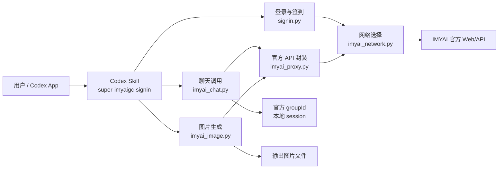
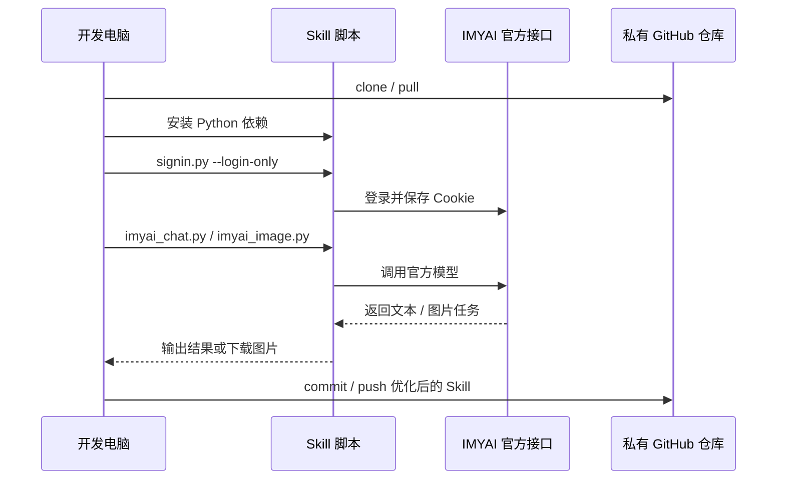
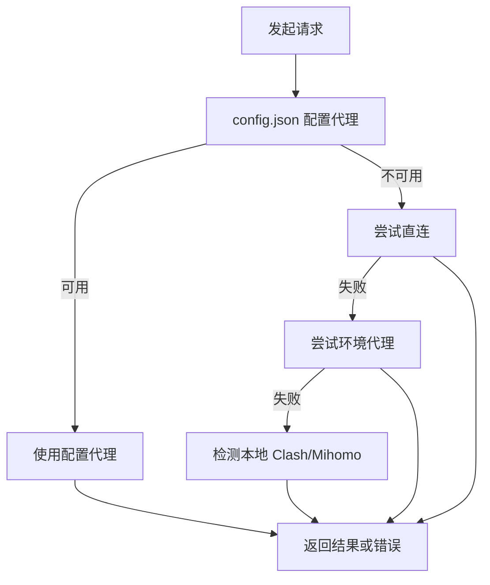

# super-imyaigc-signin

私有 Codex Skill 仓库，用于在 Codex App 中调用 IMYAI 官方聊天模型、绘图模型，并维护登录、签到、会话、模型发现和多机同步开发流程。


## 快速安装

推荐新电脑使用 GitHub CLI：

```powershell
gh auth login
mkdir $env:USERPROFILE\.codex\skills -Force
cd $env:USERPROFILE\.codex\skills
gh repo clone vegetpig/super-imyaigc-signin
cd super-imyaigc-signin
powershell -ExecutionPolicy Bypass -File .\install.ps1
```

需要安装后立刻验证登录和模型列表：

```powershell
powershell -ExecutionPolicy Bypass -File .\install.ps1 -Verify
```

也可以从 GitHub Releases 下载压缩包，解压后运行：

```powershell
powershell -ExecutionPolicy Bypass -File .\install.ps1
```

更多安装细节见 `INSTALL.md`。

## 功能总览

| 能力 | 入口脚本 | 用途 |
| --- | --- | --- |
| 登录与 Cookie 刷新 | `scripts/signin.py` | 登录 IMYAI、保存 Cookie、刷新失效会话 |
| 每日签到 | `scripts/signin.py` | 打开签到面板并领取积分 |
| 聊天模型调用 | `scripts/imyai_chat.py` | 调用 Claude、Qwen、Gemini、Ava 等 IMYAI 官方模型 |
| 会话模式 | `scripts/imyai_chat.py --session auto` | 让当前 Codex 工作区持续使用同一个 IMYAI 模型和上下文 |
| 图片生成 | `scripts/imyai_image.py` | 调用 GPT Image、Nano Banana、Qwen Image、Midjourney 等绘图模型 |
| 参考图上传 | `scripts/imyai_image.py --reference-image` | 上传本地参考图并传给绘图 runtime |
| 代理与网络选择 | `scripts/imyai_network.py` | 自动尝试配置代理、直连、环境代理、本地 Clash/Mihomo |
| 官方 API 封装 | `scripts/imyai_proxy.py` | 封装模型列表、聊天、绘图、STS 上传等底层请求 |

## 架构图



## 运行流程



## 仓库结构

```text
.
├── README.md
├── INSTALL.md
├── CHANGELOG.md
├── SKILL.md
├── CONTRIBUTING.md
├── install.ps1
├── requirements.txt
├── agents/
│   └── openai.yaml
└── scripts/
    ├── .secret_key
    ├── config.json
    ├── signin.py
    ├── imyai_chat.py
    ├── imyai_image.py
    ├── imyai_network.py
    ├── imyai_proxy.py
    └── sessions/
        ├── codex-0a41a305c964.json
        └── codex-b39c4de18152.json
```

## 新电脑初始化

在新电脑上，把仓库克隆到 Codex skills 目录：

```powershell
cd $env:USERPROFILE\.codex\skills
git clone https://github.com/vegetpig/super-imyaigc-signin.git
cd super-imyaigc-signin
```

安装依赖：

```powershell
python -m pip install -r requirements.txt
python -m playwright install chromium
```

如果新电脑已有 Chrome 或 Edge，`signin.py` 会优先尝试系统浏览器；安装 Playwright Chromium 是通用兜底方案。

## 登录与验证

检查登录并统计可用模型：

```powershell
python ".\scripts\signin.py" --phone YOUR_PHONE --model-count
```

可见浏览器登录：

```powershell
python ".\scripts\signin.py" --phone YOUR_PHONE --no-headless --login-only
```

刷新登录后，快速检查聊天模型：

```powershell
python ".\scripts\imyai_chat.py" --phone YOUR_PHONE --model "Qwen 3.6 flash" --prompt "Reply exactly: ok" --no-official-history --json
```

## 多账号签到

`scripts/config.json` 的 `accounts` 数组支持多个账号。当前已配置 3 个账号，密码通过 `scripts/.secret_key` 加密保存。

只签到单个账号：

```powershell
python ".\scripts\signin.py" --phone YOUR_PHONE --retries 1
python ".\scripts\signin.py" --phone SECOND_PHONE --retries 1
python ".\scripts\signin.py" --phone THIRD_PHONE --retries 1
```

签到全部账号：

```powershell
python ".\scripts\signin.py" --retries 1
```

自动化推荐使用幂等跳过模式：

```powershell
python ".\scripts\signin.py" --retries 1 --no-cleanup --skip-success-today
```

这个模式会把当天成功状态写入本地状态文件。后续同一天再次运行时，已成功账号会直接输出 `OK SKIPPED streakDays=X`，不会重复打开浏览器签到；当天未成功的账号仍会继续补签。

更新或新增账号密码：

```powershell
python ".\scripts\signin.py" --set-password SECOND_PHONE "<密码>"
python ".\scripts\signin.py" --set-password THIRD_PHONE "<密码>"
```

签到脚本会为每个账号保存两张截图：

- `pre-signin-*.png`：签到前页面。
- `post-signin-*.png`：签到后页面或结果弹窗。

签到完成后还会在日志里输出连续签到天数：

```text
Consecutive sign-in days: 2
```

## 聊天模型

列出可用聊天模型：

```powershell
python ".\scripts\imyai_chat.py" --phone YOUR_PHONE --list-models-compact
```

搜索模型：

```powershell
python ".\scripts\imyai_chat.py" --phone YOUR_PHONE --search-model claude
```

调用指定模型：

```powershell
python ".\scripts\imyai_chat.py" --phone YOUR_PHONE --model "Claude Sonnet 4.6" --prompt "用一段话解释 RAG 评估。" --json
```

启用当前 Codex 工作区的 IMYAI 会话模式：

```powershell
python ".\scripts\imyai_chat.py" --phone YOUR_PHONE --session auto --set-session-model "Qwen 3.6 flash" --json
python ".\scripts\imyai_chat.py" --phone YOUR_PHONE --session auto --prompt "记住暗号 bridge-726，只回复 ok" --json
python ".\scripts\imyai_chat.py" --phone YOUR_PHONE --session auto --prompt "我刚才让你记住的暗号是什么？" --json
```

## 图片生成

列出绘图模型：

```powershell
python ".\scripts\imyai_image.py" --phone YOUR_PHONE --list-models-compact
```

自动选择绘图模型并生成图片：

```powershell
python ".\scripts\imyai_image.py" --phone YOUR_PHONE --model auto --prompt "一张干净的产品风格海报，白色背景，中心是一台未来感工作站，中文标题：智能工作流" --resolution 1K --ratio 1:1 --json
```

使用参考图：

```powershell
python ".\scripts\imyai_image.py" --phone YOUR_PHONE --model "Nano Banana 2" --prompt "保持参考图主体姿态，改成赛博朋克海报风格" --reference-image "D:\path\to\reference.png" --resolution 1K --ratio 9:16 --json
```

轮询已有任务，不重复提交：

```powershell
python ".\scripts\imyai_image.py" --phone YOUR_PHONE --model "GPT Image 2" --poll-task-id 1307618 --json
```

## 多机协作策略

| 文件 | 是否同步 | 说明 |
| --- | --- | --- |
| `SKILL.md` | 是 | Codex Skill 主说明 |
| `scripts/*.py` | 是 | 核心脚本 |
| `scripts/config.json` | 是 | 账号、路径、代理等配置，当前按私有仓库同步 |
| `scripts/.secret_key` | 是 | 用于解密配置里的加密密码，多机复用时需要同步 |
| `scripts/sessions/*.json` | 是 | Codex 工作区会话状态，可同步调试 |
| `scripts/__pycache__/` | 否 | Python 运行缓存，不提交 |
| 截图、日志、Cookie 外部目录 | 否 | 当前配置在 `D:\vide coding\signin-screenshots\...`，不属于仓库目录 |

推荐协作节奏：

```powershell
git pull
# 修改脚本或文档
python ".\scripts\signin.py" --phone YOUR_PHONE --model-count
git status
git add --all
git commit -m "描述本次优化"
git push
```

## 网络与代理

网络选择由 `scripts/imyai_network.py` 统一处理：



调试网络路径：

```powershell
$env:IMYAI_NETWORK_DEBUG = "1"
python ".\scripts\imyai_chat.py" --phone YOUR_PHONE --list-models-compact
```

## 常见问题

### API 返回 401 或登录过期

```powershell
python ".\scripts\signin.py" --phone YOUR_PHONE --no-headless --login-only
```

### 搜不到指定模型

```powershell
python ".\scripts\imyai_chat.py" --phone YOUR_PHONE --search-model "模型关键词"
python ".\scripts\imyai_chat.py" --phone YOUR_PHONE --list-models-compact
```

### 图片没有下载

先用已有任务 ID 轮询，确认任务是否完成：

```powershell
python ".\scripts\imyai_image.py" --phone YOUR_PHONE --model "GPT Image 2" --poll-task-id "<任务ID>" --json
```

### 新电脑路径不一致

修改 `scripts/config.json` 里的 `paths` 字段，让 `cookie_dir`、`screenshot_dir`、`log_file`、`history_file` 指向新电脑上的实际目录。

## 发布前检查

```powershell
python ".\scripts\signin.py" --phone YOUR_PHONE --model-count
python ".\scripts\imyai_chat.py" --phone YOUR_PHONE --list-models-compact
python ".\scripts\imyai_chat.py" --phone YOUR_PHONE --model "Qwen 3.6 flash" --prompt "Reply exactly: ok" --no-official-history --json
python ".\scripts\imyai_image.py" --phone YOUR_PHONE --list-models-compact
```

## 维护原则

- Codex App 负责本地编排、读写文件、运行命令和测试。
- IMYAI 负责官方模型回复和官方绘图结果。
- 小步提交，每次只改一个清晰主题。
- 账号配置按私有仓库同步；不要把仓库切换为公开仓库。
- 运行缓存、临时输出、截图日志不进入 Git。
